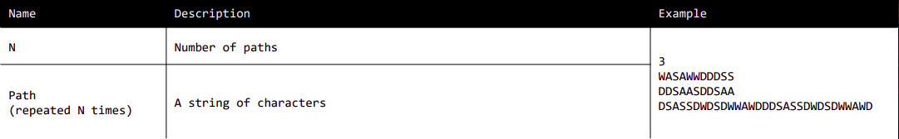

# Kotlin CCC Framework
This repository is dedicated to the Cloudflight Coding Contest. 
Here I provide an advanced scanner to ease the coding experience during the contest.
Currently I am working to provide a few important algorithms which can be applied on the fly.
In the future I want to download the input, and upload the solutions and the code to CatCoder automatically when all tests pass if enabled.

## Implementation Details
In order to find the code by the programmer using the framework, all packages are scanned.
All the programmer has to do is to annotate their functions and the framework will give hints to what is wrong in order to work.

## Usage
During the contest, participants receive a `.zip` and a Level description for every level. 
This zip-file has to be put in a directory where the framework can find it. 
After execution the framework will write the solutions into the same directory, only if the solution is correct.
To configure the location, the participant must use the `@Engine`.

### Contest.kts
The CCC Framework needs one configuration script where you can set the input folder and the wanted level as seen below.
Furthermore you can set the a cookie, which will allow you to automatically download and upload the files from Catcoder.
When you are ready just run the Contest script.
```kotlin
ccc {
    location("/path/to/zips")
    level(0)
    cookie("m2319Jid8234jhPn923m90f8vvc089") {
        autoDownload = true
        autoUpload = true
    }
}
```

`/path/to/zips` has to point to the folder where all the zips will be downloaded to.
In addition, a level can be set optionally by adding `level(x)` in the end. 
If omitted, the framework will take the highest level defined in code and execute that function.

### @Level
The `@Level` annotation is the heart of the CCC Framework.
Every level has to be annotated with this annotation and the corresponding level number.
```kotlin
@Level(1) fun foo(): String {
    return ""
}
```
As soon as this annotation is present, and the engine is set to level X the framework will search the configured directory for a zip named `levelX.zip`.
From there it will take all input files from the zip and execute the annotated function on each input file.
If the example input is solved correctly, all the other files are written to the directory `/path/to/zips/levelX` with corresponging names `levelX_Y.out`.
The framework requires the function to return a `String` or a `CharSequence`, which has to be the wanted solution.

The input to the function is the core reason this framework exists, so I am explaining it on the following example.

```kotlin
@Level(2) fun level2(
    n: Int,
    @Many("n", String::class) paths: List<String>
): String {
    return "..."
}
```
The image translates to the input in the code below.
The framework reads all parameters of the function and scans the input files according to that specification.
This means that order is very important since every field has to be read for the scanner to work.
This should be simple anyway, since all you have to do is to basically copy the CCC specification to Kotlin.
You can name the variables as you want.
For lists the `@Many` annotation is necessary for the scanner to know how many elements this list will have.

### @Many
In the previous example,
```kotlin
@Level(2) fun level2(
    n: Int,
    @Many("n", String::class) paths: List<String>
): String {
    return "..."
}
```
we see a `@Many` annotation which takes a `String` and a `Class` as parameters followed by a `List` of that type.
The `sizeParamName` parameter takes the name of the variable in order to know, how many instances it should read.
The `type` parameter takes the class that should be read. For this, any class can be provided and the primary constructor is called.
The `type` parameter is only there, because of Java's type erasure.
That means that `type` should really be the same type as the `List`s generic type.

### Custom classes
This framework accepts custom classes such as:
```kotlin
data class LawnMower(
    val width: Int, val height: Int,
    @Many("height", String::class) val lawn: List<String>,
    val path: String)
```
and can take them as a parameter in your `@Level` function and you don't have to write any more scanner code.
This class can then be used as usual and all fields are filled as expected.
Important is again, such as in the `@Level` parameters, that the order of the parameters is in the same order as in the level description from the pdf.

### `class Line`
`Line` is in essence just a wrapper for `String` which is specially handled by the scanner.
As the name suggests, the scanner reads a whole line instead of just a string token.

### @Example
During coding and debugging I realized that getting to the important edge case was hard, so I added this annotation.
`@Example` can be added to your `@Level` function to execute just certain levels, as such:
```kotlin
@Example(3) @Level(1) fun foo(): String {
    return ""
}
```
This just executes the input `level1_3.in`. 
When you think you solved the problem, remove it and execute all levels again to write your solution to the files. 
When you just write `@Example` - without value - then per default the example level is executed.
You can achieve the same effect when writing `@Example(0)`.

### @Validator
Sometimes solutions are not unique. That means that the example output is not of use really.
To solve this issue you can write a validator function.
If you add `@Validated` to your `@Level` function, then you must also write a validator for it.
To achieve this, you write a second function, with the same parameters (just copy them 1 to 1), return a `Boolean` instead of a `String` and annotate it with `@Validator`.
Here an example from our training from [Level 4 - Lawn Mowing](https://github.com/rechen-werk/CCCFramework/blob/cat-coder/lawn-mower/src/main/kotlin/eu/rechenwerk/Level4_2.kt)

```kotlin
@Validated @Level(4) fun level4(
    n: Int,
    @Many("n", LawnMowing::class) lawns: List<LawnMowing>
): String {
    return lawns
        .map { it.mow().path }
        .joinToString("\n")
}
```
```kotlin
@Validator(4) fun validator4(
    n: Int,
    @Many("n", LawnMowing::class) lawns: List<LawnMowing>
): Boolean {
    return lawns
        .map { lawn -> lawn.mow() }
        .all { lawn -> lawn.validate() }
}
```
Here it is your responsibility that the validator is correct.
In the example we have written a function to validate that the lawns are mowed correctly in the previous level and we just reused for the validator in the following level.

# Important notes
The framework assumes, that Cloudflight will not change the level names, i.e., it assumes that it will stay in the form:
```
zip name: levelX.zip
file names: levelX_Y.in, 
example: levelX_example.in -> levelX_example.out
```